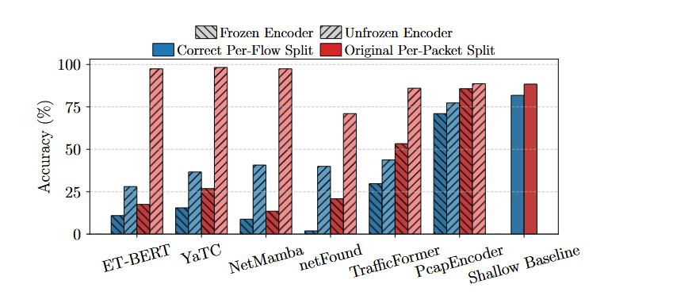

## Background

在预训练阶段通过自监督学习任务使得深度神经网络DNN、大语言模型LLM、多模态模型在多个领域取得了成功。如NLP中的BERT以及计算机视觉中的MAE：首先在预训练阶段学习如何将输入数据表示为有意义的嵌入，然后在微调阶段将嵌入能够服务于下游任务。

所以很多研究者采用这种方案来解决网络流量分类，比如ET-BERT像BERT学会表示文本一样表示数据包。它们使用了良好的预训练结构，在微调进行分类时，结果能够逼近100%，而且它们都声称能够预训练模型能够从加密数据中学习模式。

作者提出了两个质疑：

1.  在加密环境下，这些模型能提出什么信息？在流量内容已经被加密，传统基于深度包检测的方法已经失效的前提下，这些表示学习模型仍能实现高精度分类，则必须解释其依赖的信息来源是否合理。
2. 这些模型是否真的学到了有意义的流量表示，还是仅仅利用了捷径？捷径指模型在训练中学到的与任务无关但恰好与标签相关的特征（例如流标识符、序列号等），这些特征在真实部署中并不可靠，导致模型泛化能力差。

## Motivation

- 巨大的数据泄露与捷径：大多数以前的研究采用Per-Packet Split 按包拆分，将所有数据包打乱，然后随机分配。这意味着同一个网络流的数据包可能会被分散到训练集和测试集中。这严重违反了机器学习的基本准则，测试集必须完全独立于训练集。在真实世界中，你训练模型时见过的流，在部署时是不会再次出现的。`Per-Packet Split` 让模型在训练阶段就“见”过来自某些流的包，然后在测试阶段又去预测这些**同一个流**的包，这相当于“开卷考试”，不能检验模型的真实泛化能力。

  - **数据泄露**：由于同一个流的包既出现在训练集又出现在测试集，模型会**间接地知道测试包属于哪个流**。因为模型在训练时已经学习过这个流的特征。
  - **捷径学习**：模型非常聪明，它会寻找最简单的方式来完成预测任务，而不是去学习我们真正关心的“应用类型”或“服务类型”。在这种有数据泄露的设置下，最简单的捷径就是**识别数据包来自哪一个流**。
    - 模型可能会学会识别一些**隐式流标识符**，比如TCP序列号（SeqNo）、确认号（AckNo）的范围、TCP时间戳选项、IP ID字段等。这些字段在同一个流内是高度相关且独特的，但在不同流之间是随机的。
    - 一旦模型通过`SeqNo`等特征识别出测试包属于“流A”，而它在训练时已经知道“流A”的标签是“Gmail”，那么它就可以轻松且准确地将这个包预测为“Gmail”。它**根本不需要去理解这个包的内容或模式**。

  所以我们应该适用Per-Flow Split(按流划分)，将所有来自**同一个流的所有数据包，作为一个整体，全部放入训练集或全部放入测试集**。这完美模拟了真实场景：模型在训练时见过某些流，在测试时会遇到**全新的、从未见过的流**。当切断了“数据泄露”的捷径后，之前那些宣称能达到98%准确率的模型，其**真实性能暴露无遗**——准确率勉强达到40%。

这个断崖式的性能下跌证明：

1. 这些模型**根本没有学会**从加密流量中提取有意义的、泛化的特征（如应用行为模式、载荷统计特征等）。
2. 它们之前惊人的高性能几乎**完全依赖于错误的数据划分所造成的数据泄露**。
3. 在真实的、一切加密的环境下，仅凭包 payload 进行分类是**极其困难**的。

- 在下游任务中，之前所有的作品都用Fine-tuning，重新训练整个模型，当把编码器冻结时，模型的准确率下降到30%以下，这质疑了预训练阶段的模型表示能力，而且能够说明从加密有效载荷中学习模式是没有意义的。

## Contribution
